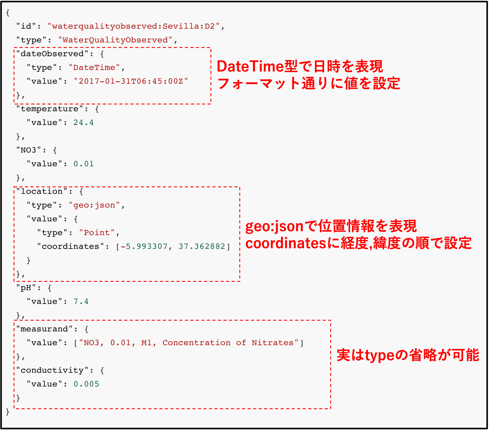

自由にOrionを利用しNGSIの学習などに活用するPlaygroundです

# FIWARE OrionとFIWARE Cygnusの起動

今回は以下の構成が自動起動されます。  
※起動の詳細に関してはFIWARE Basicの[Part4](https://www.katacoda.com/c3lab/courses/fiwarebasic/fiware-part4)を参照

ターミナルの処理が終了したら以下のコマンドで動作確認します。

`curl localhost:1026/v2/entities | jq`{{copy}}

初期データとして登録されているRoom1のEntityが表示されたら成功です。

## Attribute typeについて

Attributeのtypeはvalueのデータ型を示すものですが、Orion内では一部のデータ型以外はtypeに基づいたvalueの型チェックなどは行われません。

### フォーマットが制限されているタイプ

フォーマットに誤りがあった際はエラーが発生します。

|  type  |  説明  |  例  |
| ---- | ---- | ---- |
|  DateTime  |  日時を表現するタイプ ISO8601 形式で記述  | "2017-03-31T08:00:00Z" |
|  geo:json  |  座標などを表現するタイプ  | {"type": "Point", "coordinates": [-3.7836974, 43.4741091] } |
|  geo:point |  座標を表現するタイプ geo:jsonよりシンプル  | {"type": "geo:point", "value": "43.4741091, -3.7836974" } |

※ 参考  
[DateTime 日時のサポート](https://github.com/telefonicaid/fiware-orion/blob/c86718ec33290a02813fb04d02a8cbf90129eaf2/doc/manuals.jp/user/ngsiv2_implementation_notes.md#datetime-support)

[geo:json 属性でサポートされる GeoJSON タイプ](https://github.com/telefonicaid/fiware-orion/blob/c86718ec33290a02813fb04d02a8cbf90129eaf2/doc/manuals.jp/user/ngsiv2_implementation_notes.md#supported-geojson-types-in-geojson-attributes)

### よく名付けられるタイプの例

以下のAttribute typeはNGSIのリファレンスとなるデータモデルを公開している[smart-data-models](https://github.com/smart-data-models)でもよく使われているTypeです。

|  type  |  説明  |  例  |
| ---- | ---- | ---- |
|  Integer |  整数を表現するタイプ  | 10 |
|  Float |  浮動小数を表現するタイプ  | 0.1 |
|  Number |  整数、小数を問わず数値を表現するタイプ  | 10 |
|  Text |  文字列を表現するタイプ  | "text" |
|  Boolean |  真理値を表現するタイプ  | true |

参考：[smart-data-models](https://github.com/smart-data-models)

## WaterQuality

## FIWARE OrionおもなEntity操作

### Entity追加

`curl localhost:1026/v2/entities -s -S -H 'Content-Type: application/json' -d @sample-entity.json`{{copy}}

### Entity一覧取得

`curl localhost:1026/v2/entities | jq`{{copy}}

### Entity更新

**/v2/entities/{id}**のidで変更するEntityを指定

`curl localhost:1026/v2/entities/Room3 -s -S -H 'Content-Type: application/json' -d @sample-entity.json`{{copy}}

### Entity削除

**/v2/entities/{id}**のidで削除するEntityを指定

`curl localhost:1026/v2/entities/Room3`{{copy}}

## Fiware-Service指定

curlコマンドの末尾に `-H "Fiware-Service: {Fiware-Service名}"`を追加  
削除、追加、更新も同様の方法で可能です。

`curl localhost:1026/v2/entities/ -H "Fiware-Service: group_x" | jq`{{copy}}
