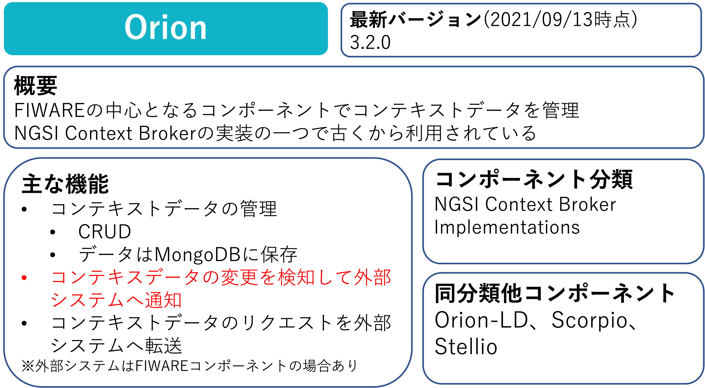
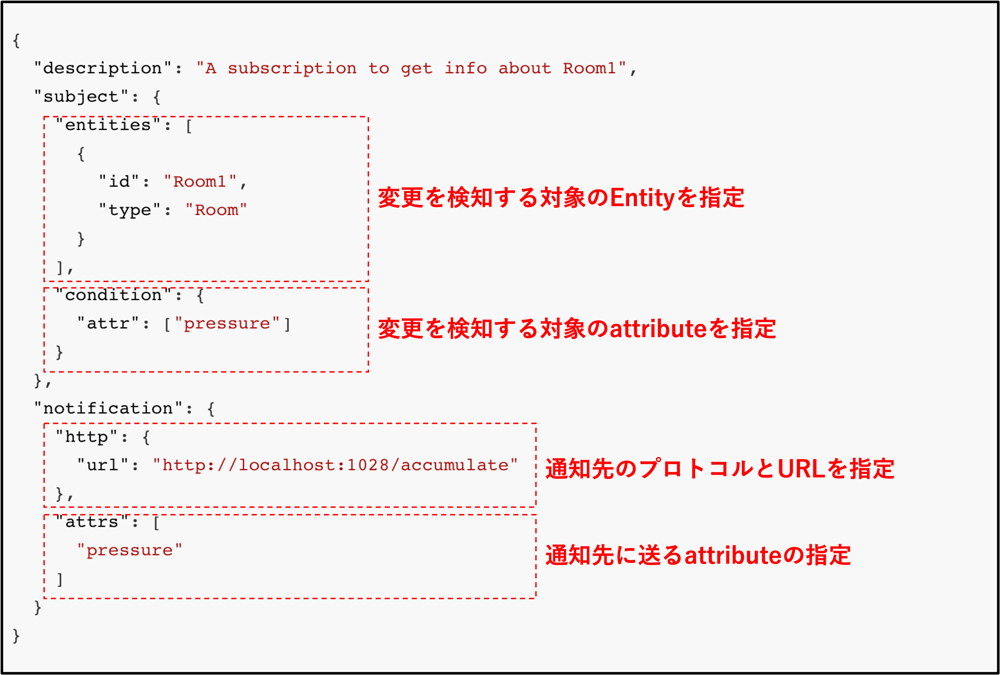
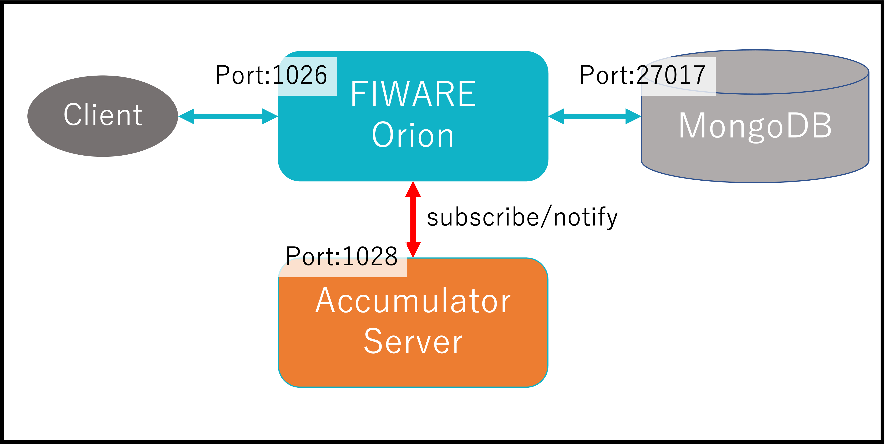
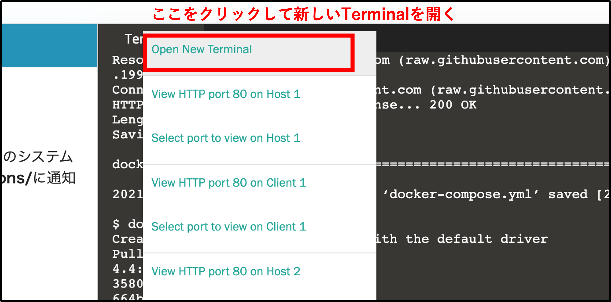
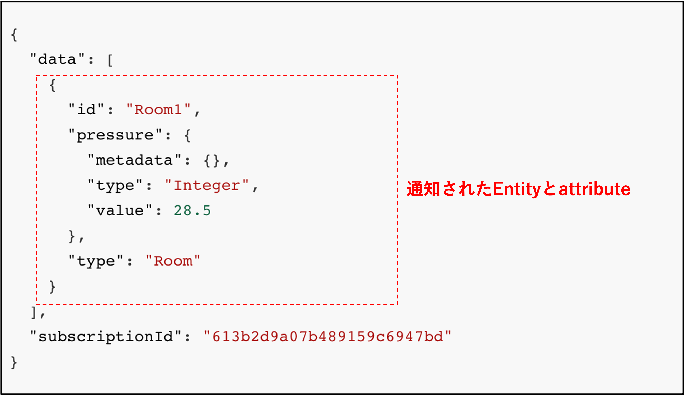

Part3ではFIWARE OrionのSubscription機能について学習していきます。



# 1-1 FIWARE OrionとMongoDBの起動確認

今回は以下の構成が自動起動されます。  
※起動の詳細に関してはFIWARE Basicの[Part1](https://www.katacoda.com/c3lab/courses/fiwarebasic/fiware-part1)または[Part2](https://www.katacoda.com/c3lab/courses/fiwarebasic/fiware-part2)を参照


ターミナルの処理が終了したら以下のコマンドで動作確認します。

`curl localhost:1026/v2/entities | jq`{{copy}}

初期データとして登録されているRoom1のEntityが表示されたら成功です。


# 1-2 FIWARE OrionのSubscription機能について

FIWARE Orionにはデータの変更を検知して特定のシステムへ通知する機能があります。
**/v2/subscriptions/**へPOSTすることで通知の設定ができます。

POSTする際のbodyは以下の通りです。



この例では**Room1**の**pressureの値**が更新されたら、通知先のURLへ**pressureのattribute**をHTTPのPOSTで送信するような設定です。

### 通知先のサンプルアプリを起動

Subscriptionの設定をする前に通知先の[FIWAREが公開しているサンプルアプリ](https://github.com/telefonicaid/fiware-orion/blob/master/scripts/accumulator-server.py)を起動します。



サンプルアプリを動作させるため、新しいTerminalを開きます。


Open New Terminalを押します。



**Terminal2**で以下のコマンドを実行し[FIWAREが公開しているサンプルアプリ](https://github.com/telefonicaid/fiware-orion/blob/master/scripts/accumulator-server.py)を起動します。

`./accumulator-server.py --port 1028 --url /accumulate --pretty-print -v`{{copy}}

これはhttpでアクセスしてきた情報をログとして表示するサーバです。  
このアプリを使ってOrionからの通知の内容を確認していきます。


### Subscriptionの設定

**元のTerminal**に戻ります。  
以下のコマンドでSubscriptionの設定を行います。


```json
curl -v localhost:1026/v2/subscriptions -s -S -H 'Content-Type: application/json' -d @- <<EOF
{
  "description": "A subscription to get info about Room1",
  "subject": {
    "entities": [
      {
        "id": "Room1",
        "type": "Room"
      }
    ],
    "condition": {
      "attr": ["pressure"]
    }
  },
  "notification": {
    "http": {
      "url": "http://[[HOST_SUBDOMAIN]]-1028-[[KATACODA_HOST]].environments.katacoda.com/accumulate"
    },
    "attrs": [
      "pressure"
    ]
  }
}
EOF
```{{copy}}


pressureの値を変更してみます。

`curl localhost:1026/v2/entities/Room1/attrs/pressure/value -s -S -H 'Content-Type: text/plain' -X PUT -d 28.5`{{copy}}

**Terminal2**を開きログを確認してみます。  
通知された結果が以下のように出力されています。



# 1-2 Subscirptionの確認

**/v2/subscriptions**に対してGETすることでsubscirptionの一覧を取得できます。

`curl localhost:1026/v2/subscriptions | jq`{{copy}}

先ほど作成したsubscriptionにidが作成されていることが確認できます。


このidを使用し**/v2/subscriptions/{id}**のように指定することで、PATCHで更新、DELETEで削除を行うことができます。

次のpartでsubscriptionの更新を行うので環境変数にsubscriptionのidを設定しておきます。  
=以降に先ほど取得したsubscription idをコピー&ペーストして実行します。

`SUBSCRIPTION_ID=`{{copy}}
